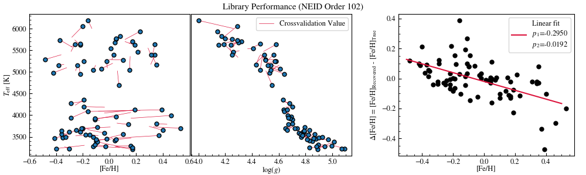

# NEIDspecmatch [](https://doi.org/10.5281/zenodo.14991480)

NEIDSpecMatch: a tool developed to extract stellar parameters from high-resolution spectra obtained with the NEID spectrograph. Based on: [HPFSpecMatch](https://gummiks.github.io/hpfspecmatch/). 


# Quick Start
We recommend follow the [tutorials](tutorial) to get started quickly. ``neidspecmatch`` is pip-installable 
```
pip install neidspecmatch
```

# Library download
``neidspecmatch`` requires a library of well-characterized stars for spectra comparison. The current library include 78 library stars. You may download them [via zenodo](https://zenodo.org/records/14947454/files/20250226_specmatch_nir.zip?download=1) or [via google drive](https://drive.google.com/drive/folders/1YPzRRKow2PD0Lhkr8fCIos6fSNbFCTS1?usp=share_link). The full directory (yyyymmdd_specmatch_nir/) need to be saved under the library/ folder.

# Cross-validation and result uncertainty 
The cross-validation is a necessary step to estimate the uncertainty of the recovered stellar parameters. To run the cross-validation on the current library, one can follow [tutorial 1](tutorial/1.%20Setup%20and%20crossvalidation.ipynb) for the desired order(s). The output include a file in the format of `crossvalidation_results_o102.csv`. One can take the standard deviation of the column d_teff, d_feh, and	d_logg on all/certain rows (depending on the star type you want to estimate the uncertainty). 


The alternative is to use the cross-validation result saved in the same link as the library, although we recommend running the cross-validation locally to check the completeness of the installation. 

# Fit a spectrum
Once the library is in place, one can run fit an arbitrary NEID spectrum following [Fit NEID spectrum](tutorial/2.%20Fit%20NEID%20spectrum.ipynb). You need to specify the file path, target name (as in the fits header), orders, and more.

# Dependencies 
These should be installed automatically with pip. But if installation fails, you may download them manually. 
- pytransit ('pip install pytransit')
- emcee (`pip install emcee`)
- astroquery (`pip install astroquery`)
- crosscorr (`pip install crosscorr`) NEED fortran installation. For Mac: brew install gcc (GNU fortran). For Ubuntu: sudo apt install gfortran
- NEIDspec (`pip install neidspec`)
- lmfit (`pip install lmfit`)
- barycorrpy (`pip install barycorrpy`)

  Known Issue: The latest version of barycorrpy deprecated some syntax used in the NEIDSpecMatch. Please use earlier versions (0.4.4 tested to work) while we update the syntax. 

# Manual Installation (depracated)
create a new conda env with
`conda create -n neidspecmatch python==3.10`
`conda activate neidspecmatch`
```
conda install numba
git clone https://github.com/hpparvi/PyDE.git
cd PyDE
pip3 install .
cd ..
pip3 install emcee
pip3 install astroquery
git clone https://github.com/TeHanHunter/crosscorr.git
cd crosscorr
brew install gcc
pip3 install .
cd ..
git clone https://github.com/TeHanHunter/neidspec.git
cd neidspec
pip3 install .
cd ..
pip3 install lmfit
pip3 install barycorrpy
pip3 install celerite
git clone https://github.com/TeHanHunter/neidspecmatch.git
cd neidspecmatch
pip3 install .
```

# Reference
TODO
